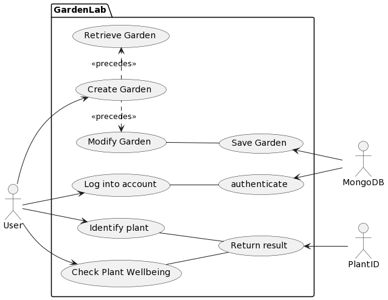
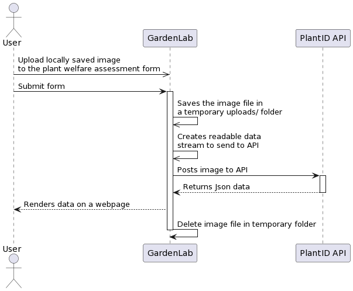
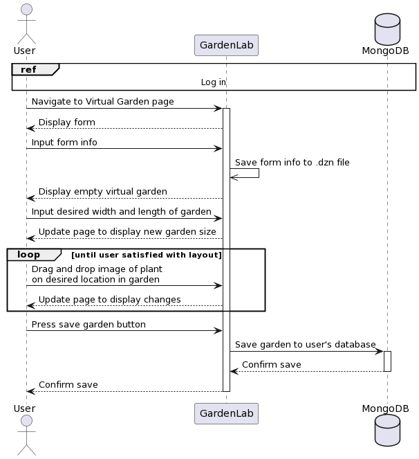
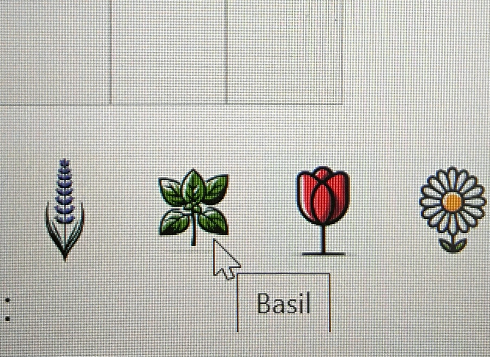

# Technical Specification

**Authors:** Anisa Hoxha - 21413586, Zara Purewal - 21404176

## 0. Table of Contents

- [Technical Specification](#technical-specification)
- [0. Table of Contents](#0-table-of-contents)
- [1. Introduction](#1-introduction)
  - [1.1 Overview](#11-overview)
  - [1.2 Glossary](#12-glossary)
- [2. System Architecture](#2-system-architecture)
- [3. High-Level Design](#3-high-level-design)
  - [3.1 Use case Diagram](#31-use-case-diagram)
  - [3.2 Sequence diagram for logging in](#32-sequence-diagram-for-logging-in)
  - [3.3 Sequence Diagram for Plant Identification Tool](#33-sequence-diagram-for-plant-identification-tool)
  - [3.4 Sequence Diagram for Plant Welfare Assessment Tool](#34-sequence-diagram-for-plant-welfare-assessment-tool)
  - [3.5 Sequence Diagram for Creating Virtual Garden Planner Tool](#35-sequence-diagram-for-creating-virtual-garden-planner-tool)
- [4. Problems and Resolution](#4-problems-and-resolution)
  - [4.1 PlantID does not provide care instructions when identifying plants](#41-plantid-does-not-provide-care-instructions-when-identifying-plants)
  - [4.2 Minizinc not working with node.js](#42-minizinc-not-working-with-nodejs)
- [5. Testing and Validation](#5-testing-and-validation)
  - [5.1 User testing (us)](#51-user-testing-us)
  - [5.2 Machine learning threshold validation](#52-machine-learning-threshold-validation)
  - [5.3 MiniZinc Satisfiability Validation](#53-minizinc-satisfiability-validation)
  - [5.4 Form validation](#54-form-validation)
  - [5.5 Login session cookie testing](#55-login-session-cookie-testing)
  - [5.6 Unit Testing](#56-unit-testing)
- [6. Design](#6-design)
  - [6.1 Garden Planner UI:](#61-garden-planner-ui)
  - [6.2 Consistent Design:](#62-consistent-design)
  - [6.3 CSS and Bootstrap:](#63-css-and-bootstrap)
  - [6.4 Intuitive Design:](#64-intuitive-design)
- [7. Installation Guide](#7-installation-guide)
  - [Prerequisites:](#prerequisites)
- [7. Resources](#7-resources)
  - [7.1 Learning Resources](#71-learning-resources)
  - [7.2 Referential Resources](#72-referential-resources)
- [8. Appendices](#8-appendices)
  - [Code for plantuml diagrams](#code-for-plantuml-diagrams)
    - [Use case Diagram](#use-case-diagram)
    - [Login sequence diagram](#login-sequence-diagram)
    - [For plant identification tool](#for-plant-identification-tool)
    - [For plant welfare assessment tool](#for-plant-welfare-assessment-tool)
    - [Sequence diagram for creating virtual garden](#sequence-diagram-for-creating-virtual-garden)

## 1. Introduction

### 1.1 Overview

GardenLab is a garden planning assistance website. It has three main features; A virtual garden planner, a plant identification section, and a plant health assessment section.
The virtual garden planner requires users to choose the width and length of their garden, and then drag and drop images of plants onto the garden grid to represent where they want the plant to go. The dimension of the garden is relative to inputted width and height.
The plant identification and the plant assessment sections work in a similar fashion. Users can upload an image of a plant that they have saved locally, to either identify the plant or assess the health of the plant.
Plant identification returns images of similar plants, name of similar plants and probability that the suggested plant is correct. Users can click on the name of the plant which will bring up a google search that will provide care instructions of the plant.
Plant assessment returns images of possible things wrong with the plant, along with the name of the ailment and a probability that the suggestion is correct. Below each image is a set of treatments ranging from chemical treatment, biological treatments and preventative measures.

### 1.2 Glossary

- **node.js**: A javascript environment used to build our application.
- **express.js**: A node.js web application framework.
- **Constraint satisfaction engine**: A computational tool that efficiently finds solutions to constraint satisfaction problems.
- **MiniZinc**: A constraint satisfaction engine.
- **Multer**: A node.js middleware for handling multipart/form-data.
- **Axios**: A promise-based HTTP Client for node.js and the browser.
- **Dotenv**: A tool for managing environment variables in Node.js projects.
- **MongoDB**: The database used for this project.
- **PlantID API**: A plant and plant diseases machine learning API tool.
- **bycrypt**: A library used to hash passwords.
- **jest**: Testing framework for unit testing.
- **DOM**: Document Object Model.
- **JsDOM**: JavaScript implementation of many web standards.
- **.dzn file**: A data file compatible with MiniZinc.

## 2. System Architecture

The system architecture is composed of three primary components: the GardenLab web app, the GardenLab database, and external APIs (Plant.id API). These components interact with each other to provide a seamless user experience.

## 3. High-Level Design

### 3.1 Use case Diagram

The use case diagram illustrates the interactions between the system and its users, highlighting the key functionalities available.

### 3.1 Sequence diagram for logging in

This sequence diagram shows the process a user goes through to log into the GardenLab app.

### 3.2 Sequence Diagram for Plant Identification Tool

Describes the workflow for identifying a plant using the PlantID API.

### 3.3 Sequence Diagram for Plant Welfare Assessment Tool

Outlines the steps for assessing the health of a plant through the web app.

### 3.4 Sequence Diagram for Creating Virtual Garden Planner Tool

Illustrates the process for creating a virtual garden, including selecting plants and arranging them within a garden plot.

## 4. Problems and Resolution

### 4.1 PlantID does not provide care instructions when identifying plants

A workaround involves directing users to a Google search for care instructions based on the plant name identified.

### 4.2 Minizinc not working with node.js

Due to integration issues with MiniZinc and node.js, a direct solution was not found within the project's timeframe, leading to a simplified virtual garden feature.

## 5. Testing and Validation

### 5.1 User Testing

Focused on ensuring the usability and functionality of the web app through team-based testing.

### 5.2 Machine learning threshold validation

Involved testing the accuracy of the PlantID API's plant identification feature.

### 5.3 MiniZinc Satisfiability Validation

Tested the limitations of the MiniZinc constraint satisfaction engine with the provided garden data.

### 5.4 Form validation

Ensured that user inputs meet specific criteria for registration and login forms.

### 5.5 Login session cookie testing

Tested the persistence of user sessions across different pages of the application.

### 5.6 Unit Testing

Utilized jest for testing individual functions and components of the web app.

## 6. Design

Focused on creating a user-friendly interface with intuitive navigation and consistent design across the platform.

## 7. Installation Guide

### Prerequisites:

- Web browser, stable internet connection, text editor, command-line terminal, Node.js, Git.

## 7. Resources

### 7.1 Learning Resources

Listed resources were used to gain knowledge on MiniZinc, API integration, and other technical aspects of the project.

### 7.2 Referential Resources

References for API documentation, express.js routing, file handling with multer, and environment variable management with dotenv.

## 8. Appendices

### Code for plantuml diagrams

Includes UML diagrams for use cases, login sequences, plant identification, plant welfare assessment, and virtual garden creation processes.
